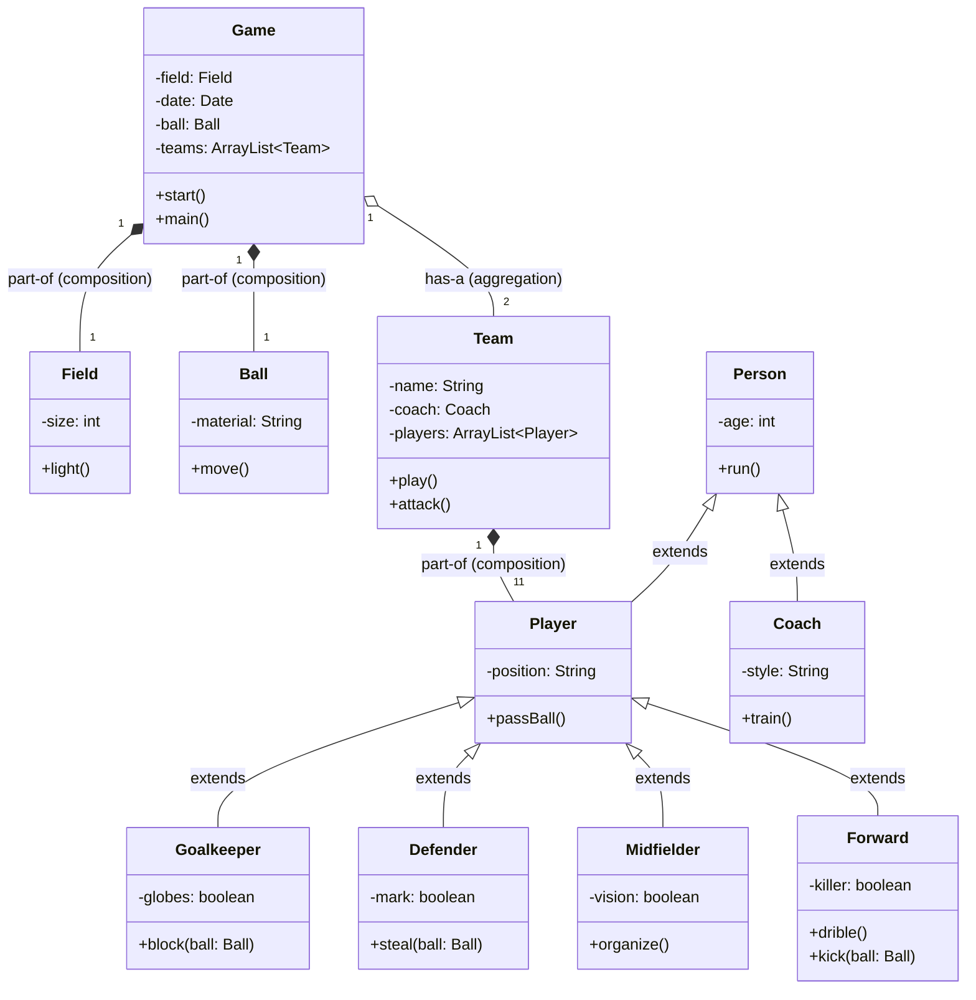

# ⚽ World Cup Simulator — OOP & Git Workflow Project

<div align="center">

[](https://www.php.net/)
[](https://git-scm.com/)
[](https://github.com/features/actions)
[](https://www.apachefriends.org/)
[](#)
[](https://www.stucom.com/)

<p align="center">
  <b>Simulador de partido de fútbol orientado a objetos y banco de pruebas avanzado de Git Flow, branching strategies, integración continua (CI) y resolución colaborativa de conflictos.</b>
</p>

[🇪🇸 Leer en Español](#-versión-en-español) | [🇬🇧 Read in English](#-english-version)

---

</div>

---

# 🇪🇸 Versión en Español

## 📌 Sobre el Proyecto

Este proyecto ha sido desarrollado en el marco del **Módulo de Proyecto Intermodular** de **2º de Desarrollo de Aplicaciones Web (DAW)** en **STUCOM Centre d'Estudis (Pelai, Barcelona)**.

El propósito principal va más allá de construir una aplicación funcional: está diseñado como un **entorno de simulación profesional de ingeniería de software** para dominar el trabajo en equipo con **Git**, diseño de software guiado por **diagramas UML**, principios de **Programación Orientada a Objetos (POO)** y automatización mediante **CI/CD**.

---

## 👥 Equipo de Desarrollo

Proyecto desarrollado de forma colaborativa por:

* ⚽ **Ignacio Breñas**
* ⚽ **Gorka Ramirez**
* ⚽ **Zehao Yin**
* ⚽ **Roger Tito**

---

## 🎯 Objetivos y Competencias Adquiridas

1. **Estrategia avanzada de ramas (Branching Strategy & Git Flow):**
   * Creación de ramas atómicas por *feature* y *bugfix* vinculadas a issues específicos (`feature/*`, `fix/*`).
   * Ciclo de vida de integración en dos etapas: `feature-branch` ➔ `staging` ➔ `main` (producción).
   * Pull Requests (PR) rigurosas con revisión de código y validación automatizada.
2. **Generación y resolución deliberada de conflictos de fusión (Merge Conflicts):**
   * Simulación realista de conflictos concurrentes entre desarrolladores en las mismas líneas y métodos (p. ej. `Midfielder::organize()`, frases de `Player::passBall()`).
   * Resolución manual y limpia de conflictos preservando la integridad del código.
3. **Interpretación e implementación rigurosa de diagramas UML:**
   * Traducción exacta de un diagrama de clases formal a código PHP 8.2 moderno con tipado estricto.
4. **Dominio de conceptos de Programación Orientada a Objetos (POO):**
   * **Herencia:** Jerarquías extensibles (`Person` ➔ `Player` / `Coach`; `Player` ➔ `Goalkeeper`, `Defender`, `Midfielder`, `Forward`).
   * **Composición y Agregación:** Relaciones de ciclo de vida (`Game` compuesto por `Field` y `Ball`; `Game` agrega `Team`; `Team` compuesto por `Player`).
   * **Encapsulación y tipado estricto:** Propiedades privadas/protegidas, getters, setters y *type hinting*.
5. **Integración Continua (CI Pipeline) con GitHub Actions:**
   * Ejecución automática de linters sintácticos (`php -l`).
   * Detección preventiva de marcadores de conflicto huérfanos (`<<<<<<<`, `>>>>>>>`).
   * Reglas de protección de ramas (`branch-policy`).

---

## 🏗️ Arquitectura y Diagrama de Clases (UML)

La estructura del dominio refleja un ecosistema de simulación deportiva desacoplado y extensible:



---

## 🌿 Flujo de Trabajo Git y Resolución de Conflictos

El equipo implementó un flujo de trabajo profesional diseñado para entornos corporativos:

```
[Issue en GitHub] 
       │
       ▼
[Rama Feature/Fix] (p. ej. feature-create-player, fix-encapsulation)
       │
       ▼
[Pull Request contra 'staging']
       │
       ├──> CI: Syntax Lint (php -l)
       ├──> CI: Conflict Markers check
       └──> Peer Review & Merge
       │
       ▼
[Rama 'staging'] (integración y pruebas conjuntas)
       │
       ▼
[Pull Request: staging -> main]
       │
       └──> CI: Branch policy enforcement
       │
       ▼
[Rama 'main'] (Producción estable)
```

### Casos de Estudio Reales Resueltos Durante el Desarrollo:
* **Resolución de conflictos en `organize()`:** Dos miembros del equipo desarrollaron implementaciones paralelas de la táctica del mediocampista generando un conflicto de merge forzado. Se resolvió integrando de forma armónica ambas tácticas.
* **Refactorización de clase intermedia `Player`:** Desacoplamiento de la herencia directa para que los roles de campo extendieran de `Player` y este a su vez de `Person`, cumpliendo con el principio de responsabilidad única y las especificaciones del diagrama UML.
* **Corrección de encapsulamiento y visibilidad:** Estandarización de atributos privados y adición de tipado fuerte en `Goalkeeper`, `Defender` y `Ball`.

---

## ⚙️ Pipeline de CI/CD (GitHub Actions)

El repositorio cuenta con un flujo automatizado en `.github/workflows/ci.yml`:
1. **Branch Policy:** Garantiza que nadie pueda realizar un Pull Request directo a `main` a menos que proceda de `staging`.
2. **PHP Lint:** Analiza automáticamente cada fichero `*.php` con `php -l` bajo PHP 8.2 para asegurar cero errores de sintaxis antes del merge.
3. **Conflict Markers:** Escaneo preventivo en el código para asegurar que no se suban por error restos de marcadores Git (`<<<<<<<`, `=======`, `>>>>>>>`).

---

## 🚀 Ejecución del Proyecto

### Requisitos
* PHP 8.1 o superior (recomendado PHP 8.2+)
* Servidor Web (opcional): Apache / XAMPP

### Opción 1: Ejecución por Consola (CLI)
```bash
php src/worldcup/Game.php
```

### Opción 2: Ejecución en Entorno Web (XAMPP / Apache)
1. Coloca el repositorio en tu directorio `htdocs` (p. ej. `C:\xampp\htdocs\Proyecto\STUCOM-Pelai-MP0616_Git_PHP_Football`).
2. Inicia Apache desde el panel de control de XAMPP.
3. Abre tu navegador web y dirígete a:
   ```
   http://localhost/Proyecto/STUCOM-Pelai-MP0616_Git_PHP_Football/src/worldcup/index.html
   ```
4. Pulsa en **"Start Match"** para simular las acciones del partido.

---

<br>

---

# 🇬🇧 English Version

## 📌 About the Project

This project was built as part of the **Intermodular Project Module** in the **2nd year of Web Application Development (DAW)** at **STUCOM Centre d'Estudis (Pelai, Barcelona)**.

Its primary goal reaches beyond creating a working game: it serves as a **professional software engineering training ground** to master collaborative **Git workflows**, UML-driven software design, modern **Object-Oriented Programming (OOP)** in PHP 8.2, and automated **CI/CD validation**.

---

## 👥 Development Team

Collaboratively designed and implemented by:

* ⚽ **Ignacio Breñas**
* ⚽ **Gorka Ramirez**
* ⚽ **Zehao Yin**
* ⚽ **Roger Tito**

---

## 🎯 Key Objectives & Acquired Competencies

1. **Advanced Branching Strategies & Git Flow:**
   * Creation of isolated feature/fix branches linked to project issues (`feature/*`, `fix/*`).
   * Staged deployment workflow: `feature-branch` ➔ `staging` ➔ `main` (production).
   * Pull Request (PR) workflow with peer code reviews and automated status checks.
2. **Intentional Merge Conflict Generation & Resolution:**
   * Real-world simulation of concurrent team edits on identical methods (e.g. `Midfielder::organize()`, `Player::passBall()`).
   * Clean manual conflict resolution preserving code integrity and project guidelines.
3. **UML Diagram Comprehension & Implementation:**
   * Direct translation of a formal class diagram into clean, typed PHP 8.2 code.
4. **Object-Oriented Programming (OOP) Excellence:**
   * **Inheritance:** Multilevel hierarchies (`Person` ➔ `Player` / `Coach`; `Player` ➔ `Goalkeeper`, `Defender`, `Midfielder`, `Forward`).
   * **Composition vs Aggregation:** Modeling real-world lifecycles (`Game` composite of `Field` & `Ball`; `Game` aggregates `Team`; `Team` composite of 11 `Player` instances).
   * **Encapsulation:** Private properties, getters, setters, and strict type hinting.
5. **Continuous Integration (CI) with GitHub Actions:**
   * Automatic syntax linting across all files via `php -l`.
   * Conflict marker detector to prevent unmerged conflict fragments (`<<<<<<<`, `>>>>>>>`).
   * Strict branch policy validation before code enters production.

---

## 🏗️ Architecture & Class Diagram (UML)

The domain design models an extensible match simulation engine:


---

## 🌿 Collaborative Git Flow & Conflict Resolution

The team applied an industry-standard development lifecycle:

```
[GitHub Issue] 
       │
       ▼
[Feature/Fix Branch] (e.g., feature-create-player, fix-encapsulation)
       │
       ▼
[Pull Request to 'staging']
       │
       ├──> CI: Syntax Lint (php -l)
       ├──> CI: Conflict Markers check
       └──> Peer Review & Approval
       │
       ▼
['staging' Branch] (Shared integration branch)
       │
       ▼
[Pull Request: staging -> main]
       │
       └──> CI: Branch policy check
       │
       ▼
['main' Branch] (Production-ready)
```

### Real Engineering Challenges Overcome:
* **Concurrent merge conflict in `organize()`:** Two developers committed distinct organizational tactics simultaneously. The conflict was intentionally triggered and successfully solved by combining both strategies cleanly.
* **Intermediate `Player` Class Extraction:** Refactored the inheritance structure so specific pitch roles inherit from an intermediate `Player` class rather than directly from `Person`, honoring OOP principles and UML design specs.
* **Encapsulation Standardisation:** Refactored property visibilities and added strict type declarations to `Goalkeeper`, `Defender`, and `Ball`.

---

## ⚙️ Automated CI Pipeline (GitHub Actions)

Located in `.github/workflows/ci.yml`:
* **Branch Policy Enforcement:** Verifies that direct pull requests into `main` are blocked; only merges originating from `staging` are permitted.
* **PHP Lint (`php -l`):** Runs automated syntax checks against all PHP files under PHP 8.2.
* **Conflict Marker Scan:** Ensures no unfinished git merge markers are accidentally published.

---

## 🚀 How to Run

### Requirements
* PHP 8.1 or higher (PHP 8.2+ recommended)
* Web Server (optional): Apache / XAMPP

### Command Line Interface (CLI)
```bash
php src/worldcup/Game.php
```

### Web Browser Interface (Apache / XAMPP)
1. Place the project directory inside your web root (e.g. `C:\xampp\htdocs\Proyecto\STUCOM-Pelai-MP0616_Git_PHP_Football`).
2. Start Apache in your XAMPP Control Panel.
3. Open your browser and navigate to:
   ```
   http://localhost/Proyecto/STUCOM-Pelai-MP0616_Git_PHP_Football/src/worldcup/index.html
   ```
4. Click on **"Start Match"** to trigger the match simulation.

---

## 🛠️ Stack Tecnológico / Tech Stack

| Área | Tecnologías |
| :--- | :--- |
| **Backend** | PHP 8.2 (Object-Oriented Programming, PSR Autoloading) |
| **Control de Versiones** | Git, GitHub, Git Flow (Feature Branches, Staging, Main) |
| **Integración Continua (CI)** | GitHub Actions (Branch Policies, PHP Linting, Conflict Scanner) |
| **Modelado y Arquitectura** | UML (Class Diagrams), Mermaid.js |
| **Servidor y Entorno** | Apache 2.4, XAMPP |
| **Frontend** | HTML5 |

---

<div align="center">
  <sub>STUCOM Pelai — Ciclo Formativo de Grado Superior en Desarrollo de Aplicaciones Web (2º DAW) — 2026</sub>
</div>
